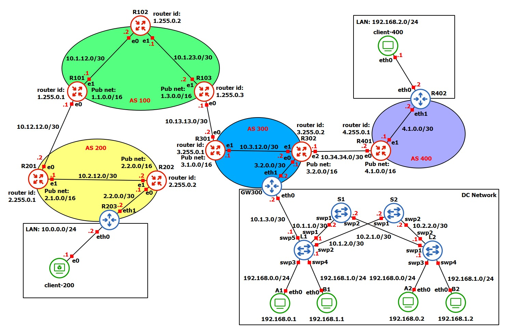

# Progetto-NSD

Progetto per il corso di _Network and System Defence_.

**Autori**

- :man_technologist: Enrico D'Alessandro (matricola 0306424)
- :man_technologist: Luca Mastrobattista (matricola 0292461)

## Topologia

<p align="center">
  
</p>

## Indice

1. [AS100](#AS100)
    1. [R101](#R101)
    1. [R102](#R102)
    1. [R103](#R103)

1. [AS200](#AS200)
    1. [R201](#R201)
    1. [R202](#R202)
    1. [R203](#R203)
    1. [Client-200](#Client-200)
        1. [Open VPN](#OpenVPN)
        1. [MAC - AppArmor](#MAC-AppArmor)

1. [AS300](#AS300)
    1. [R301](#R301)
    2. [R302](#R302)
    3. [GW300](#GW300)
        1. [Open VPN](#OpenVPN)

    4.  [Datacenter](#Datacenter)
        1. [Spine](#Spine)
            1. [S1](#S1)
            2. [S2](#S2)
        3. [Foglie](#Foglie)
            1. [L1](#L1)
            2. [L2](#L2)
        5. [Tenants](#Tenants)
            1. [A1](#A1)
            2. [A2](#A2)
            1. [B1](#B1)
            2. [B2](#B2)

1. [AS400](#AS400)
    1. [R401](#R401)
    2. [R402](#R402)
        1. [Open VPN](#OpenVPN)
    1. [Client-400](#Client-400)

# AS100
L'_autonomous system 100_ offre funzionalità di transito fornendo accesso alla rete per i due _customers_ AS200 e AS300. In questo AS è stato configurato il _peering_ eBGP con i due AS _customer_, il peering iBGP tra i router di bordo, OSPF per il routing interno ed infine LDP/MPLS per la core network.

## R101
Si procede con la configurazione delle interfacce `eth0`, `eth1` e di loopback `lo`:
```
interface eth0
 ip address 10.12.12.1/30
exit
!
interface eth1
 ip address 10.1.12.1/30
 mpls enable
exit
!
interface lo
 ip address 1.1.0.1/16
 ip address 1.255.0.1/32
 mpls enable
exit
```

Si procede con la configurazione del protocollo BGP:
```
router bgp 100
 bgp router-id 1.255.0.1
 neighbor 1.255.0.3 remote-as 100
 neighbor 1.255.0.3 update-source 1.255.0.1
 neighbor 10.12.12.2 remote-as 200
 !
 address-family ipv4 unicast
  network 1.1.0.0/16
  neighbor 1.255.0.3 next-hop-self
 exit-address-family
exit
```

Si procede con la configurazione del protocollo OSPF:
```
router ospf
 ospf router-id 1.255.0.1
 network 1.255.0.1/32 area 0
 network 10.1.12.0/30 area 0
exit
```

Si procede con la configurazione del protocollo MPLS:
```
mpls ldp
 router-id 1.255.0.1
 ordered-control
 !
 address-family ipv4
  discovery transport-address 1.255.0.1
  !
  interface eth1
  exit
  !
  interface lo
  exit
  !
 exit-address-family
 !
exit
```

 **N.B**: per utilizzare correttamente MPLS è necessario abilitare le interfacce che possono accettare pacchetti MPLS. In particolare, è stato necessario modificare il file `/etc/sysctl.conf` con l'aggiunta dei seguenti parametri di configurazione:
```
net.mpls.conf.lo.input = 1
net.mpls.conf.eth1.input = 1
net.mpls.platform_labels = 100000
```
Inoltre, per rendere attive le modifiche è necessario utilizzare il comando `sysctl -p`.
 

## R102

Si procede con la configurazione delle interfacce `eth0`, `eth1` e di loopback `lo`:
```
interface eth0
 ip address 10.1.12.2/30
 mpls enable
exit
!
interface eth1
 ip address 10.1.23.1/30
 mpls enable
exit
!
interface lo
 ip address 1.255.0.2/32
 mpls enable
exit
```

Si procede con la configurazione del protocollo OSPF:
```
router ospf
 ospf router-id 1.255.0.2
 network 1.255.0.2/32 area 0
 network 10.1.12.0/30 area 0
 network 10.1.23.0/30 area 0
exit
```

Si procede con la configurazione del protocollo MPLS:
```
mpls ldp
 router-id 1.255.0.2
 ordered-control
 !
 address-family ipv4
  discovery transport-address 1.255.0.2
  !
  interface eth0
  exit
  !
  interface eth1
  exit
  !
  interface lo
  exit
  !
 exit-address-family
 !
exit
```

**N.B**: per utilizzare correttamente MPLS è necessario abilitare le interfacce che possono accettare pacchetti MPLS. In particolare, è stato necessario modificare il file `/etc/sysctl.conf` con l'aggiunta dei seguenti parametri di configurazione:
```
net.mpls.conf.lo.input = 1
net.mpls.conf.eth0.input = 1
net.mpls.conf.eth1.input = 1
net.mpls.platform_labels = 100000
```
Inoltre, per rendere attive le modifiche è necessario utilizzare il comando `sysctl -p`.
 

## R103
Si procede con la configurazione delle interfacce `eth0`, `eth1` e di loopback `lo`:
```
interface eth0
 ip address 10.13.13.1/30
exit
!
interface eth1
 ip address 10.1.23.2/30
 mpls enable
exit
!
interface lo
 ip address 1.255.0.3/32
 ip address 1.3.0.1/16
 mpls enable
exit
```

Si procede con la configurazione del protocollo BGP:
```
router bgp 100
 bgp router-id 1.255.0.3
 neighbor 1.255.0.1 remote-as 100
 neighbor 1.255.0.1 update-source 1.255.0.3
 neighbor 10.13.13.2 remote-as 300
 !
 address-family ipv4 unicast
  network 1.3.0.0/16
  neighbor 1.255.0.1 next-hop-self
 exit-address-family
exit
```

Si procede con la configurazione del protocollo OSPF:
```
router ospf
 ospf router-id 1.255.0.3
 network 1.255.0.3/32 area 0
 network 10.1.23.0/30 area 0
exit
```

Si procede con la configurazione del protocollo MPLS:
```
mpls ldp
 router-id 1.255.0.3
 ordered-control
 !
 address-family ipv4
  discovery transport-address 1.255.0.3
  !
  interface eth1
  exit
  !
  interface lo
  exit
  !
 exit-address-family
 !
exit
```

**N.B**: per utilizzare correttamente MPLS è necessario abilitare le interfacce che possono accettare pacchetti MPLS. In particolare, è stato necessario modificare il file `/etc/sysctl.conf` con l'aggiunta dei seguenti parametri di configurazione:
```
net.mpls.conf.lo.input = 1
net.mpls.conf.eth1.input = 1
net.mpls.platform_labels = 100000
```
Inoltre, per rendere attive le modifiche è necessario utilizzare il comando `sysctl -p`.


# AS200
L'_autonomous system 200_ è uno degli AS customer connesso all'AS100 precedementemente discusso. In questo AS è stato configurato il _peering_ eBGP con l'AS 100, il peering iBGP, OSPF per il routing tra i nodi R201 e R202, mentre tra R202 e R203 il routing è stato configurato staticamente. In particolare, il router R203 non è un BGP speaker, ha una rotta di default verso R202 e svolge la funzione di access gateway per la LAN ad esso collegata.

## R201
Si procede con la configurazione delle interfacce `eth0`, `eth1` e di loopback `lo`

```
interface eth0
 ip address 10.12.12.2/30
exit
!
interface eth1
 ip address 10.2.12.1/30
exit
!
interface lo
 ip address 2.1.0.1/16
 ip address 2.255.0.1/32
exit
```

Si procede con la configurazione del protocollo OSPF:

```
router ospf
 ospf router-id 2.255.0.1
 network 2.1.0.0/16 area 0
 network 2.255.0.1/32 area 0
 network 10.2.12.0/30 area 0
exit
```

Si procede con la configurazione del protocollo BGP:

```
router bgp 200
 neighbor 2.255.0.2 remote-as 200
 neighbor 2.255.0.2 update-source 2.255.0.1
 neighbor 10.12.12.1 remote-as 100
 !
 address-family ipv4 unicast
  network 2.1.0.0/16
  neighbor 2.255.0.2 next-hop-self
 exit-address-family
exit
```

## R202

Si procede con la configurazione delle interfacce `eth0`, `eth1` e di loopback `lo`:

```
interface eth0
 ip address 2.2.0.1/30
exit
!
interface eth1
 ip address 10.2.12.2/30
exit
!
interface lo
 ip address 2.2.0.1/16
 ip address 2.255.0.2/32
exit
```

Si procede con la configurazione del protocollo OSPF:

```
router ospf
 ospf router-id 2.255.0.2
 network 2.2.0.0/16 area 0
 network 2.255.0.2/32 area 0
 network 10.2.12.0/30 area 0
exit
```

Si procede con la configurazione del protocollo BGP:
```
router bgp 200
 neighbor 2.255.0.1 remote-as 200
 neighbor 2.255.0.1 update-source 2.255.0.2
 !
 address-family ipv4 unicast
  network 2.2.0.0/16
  neighbor 2.255.0.1 next-hop-self
 exit-address-family
exit
```

## R203
Il router 203 viene configurato per svolgere le funzionalità di NAT dinamico e di firewall per consentire soltanto le connessione iniziate dalla LAN. 

### Configurazione interfacce

```bash
# abilita forwarding
sysctl -w net.ipv4.ip_forward=1

ip addr add 10.0.0.2/24 dev eth0
ip addr add 2.2.0.2/30 dev eth1
ip route add default via 2.2.0.1
```

### Configurazione NAT e firewall
```bash
# flush delle regole
iptables -F
# abilita NAT
iptables -A POSTROUTING -t nat -o eth1 -j MASQUERADE

# politiche di default per le varie catene
iptables -P FORWARD DROP
iptables -P INPUT DROP
iptables -P OUTPUT DROP

# accetta il passaggio solo di pacchetti appartenenti a connessioni già stabilite
iptables -A FORWARD -m state --state ESTABLISHED -j ACCEPT
# permette l'inoltro di tutti i pacchetti provenienti dalla LAN
iptables -A FORWARD -i eth0 -o eth1 -j ACCEPT
```


## Client-200

Il client è implementato tramite una macchina virtuale contenente _Lubuntu 22.04_. La configurazione delle interfacce è la seguente:

```bash
sudo ip addr add 10.0.0.1/24 dev enp0s8
sudo ip route add default via 10.0.0.2
```

### OpenVPN
Il client 200 deve essere configurato per agire come un client OpenVPN. Per far questo, è necessario del materiale crittografico:
- certificato del client
- chiave privata del client
- certificato della _certification authority_

Tutto il materiale crittografico è, nel nostro caso, generato dal [gateway 300](#gw300), che svolge il ruolo di server OpenVPN. 

Inoltre, è necessario definire un file di configurazione `.ovpn`, che per il client-200 è il seguente:

```ovpn
client
dev tun
proto udp
remote 3.2.0.2 1194
resolv-retry infinite
ca /root/ovpn/ca.crt
cert /root/ovpn/client-200.crt
key /root/ovpn/client-200.key
remote-cert-tls server
cipher AES-256-GCM
```

Con questo file specifichiamo che si agisce come client e si partecipa a una overlay VPN di livello 3. È necessario specificare i path al materiale crittografico sopra citato.


Per iniziare la connessione openvpn, si utilizza il comando:
```bash
openvpn /root/ovpn/client-200.ovpn
```

### MAC-AppArmor

Il _Linux Security Module_ scelto è AppArmor. L’approccio seguito dal LSM è che ogni processo può avere un suo profilo. In particolare, un profilo è un confinamento di
un programma ad un insieme di file, capabilities, accessi di rete e limiti di risorse. AppArmor adotta la politica del _selective confinement_, ovvero, se un
processo non ha un profilo, allora questo girerà secondo le tradizionali Linux DAC. Le policy sono in `/etc/apparmor.d`. 

AppArmor può lavorare in due modalità:

- `enforcement`, applica rigorosamente le regole di sicurezza definite nel profilo e qualsiasi tentativo di accesso a risorse non consentite verrà bloccato.

- `complain`, monitora le violazioni delle regole definite nel profilo senza bloccarle, registrando però un avviso nel log del sistema.

Poiché il client 200 è una macchina sensibile, è stato scelto di realizzare un profilo che limiti l'esecuzione dei comandi bash a un suo sottoinsieme. Per evitare di profilare la shell `/bin/bash`, abbiamo scelto di copiare il file in uno nuovo: `/bin/nsduser_bash`. Il profilo verrà quindi generato per quest'ultimo eseguibile. 

La generazione del profilo, prevede l'esecuzione del comando
 ```bash
 sudo aa-genprof /bin/nsduser_bash
 ```
 
 ed il successivo lancio dell'eseguibile in un altro terminale. Qui, sono stati lanciati diversi comandi di cui consentire o negare esplicitamente l'esecuzione. 

Il profilo ottenuto, è stato poi esteso manualmente e successivamente ricaricato con il comando 
```bash
sudo apparmor_parser -r /etc/apparmor.d/usr.bin.nsduser_bash
```

Al termine delle operazioni, il profilo risultante è il seguente:

```
# Last Modified: Mon Feb 26 15:37:04 2024
abi <abi/3.0>,

include <tunables/global>

/usr/bin/nsduser_bash {
  include <abstractions/base>
  include <abstractions/bash>
  include <abstractions/consoles>

  deny owner /home/*/super_secrets/read_only/* w,
  deny owner /home/*/super_secrets/write_only/* r,
  owner /home/ rw,
  owner /home/** rw,
  owner /root/ rw,
  owner /root/** rw,
  /home/*/super_secrets/read_only/* r,
  /home/*/super_secrets/write_only/* w,


  /etc/init.d/ r,
  /etc/nsswitch.conf r,
  /etc/passwd r,
  /home/*/super_secrets/ r,
  /home/*/super_secrets/read_only/ r,
  /home/*/super_secrets/write_only/ r,
  /usr/bin/basename mrix,
  /usr/bin/cat mrix,
  /usr/bin/dash ix,
  /usr/bin/dirname mrix,
  /usr/bin/lesspipe mrix,
  /usr/bin/mkdir mrwix,
  /usr/bin/touch mrix,
  /usr/bin/rm mrix,
  /usr/bin/groups mrix,
  /usr/bin/nsduser_bash mr,
  /usr/share/bash-completion/bash_completion r,
  owner /home/*/.bash_history rw,
  owner /home/*/.bashrc r,
}
```

In questo modo, siamo riusciti a limitare le capacità degli utenti, incluso root. Infatti, nessun utente può navigare all'interno delle cartelle `/home` degli altri utenti, nemmeno diventando root. Più precisamente, il profilo nega la navigazione degli utenti all'interno dello spazio di lavoro altrui impedendo anche l'esecuzione dei comandi `sudo` e `su`.

Inoltre, per testare le limitazioni delle capacità di un utente anche all'interno del proprio spazio di lavoro, sono state create due cartelle: una _read-only_ e l'altra _write-only_. Come suggerisce il nome, le due cartelle permettono solo operazioni di lettura e scrittura rispettivamente anche all'utente proprietario.

La shell ottenuta, permette l'esecuzione solo degli eseguibili esplicitamente riportati nel profilo: tutti gli altri saranno negati.

Tra gli svantaggi, però, c'è che la shell deve essere utilizzata come shell utente anche per root, ma facendolo l'operazione risulterebbe irreversibile a meno di ulteriori configurazioni. Inoltre, nel nostro esempio, i comandi permessi sono soltanto quelli tipicamente utilizzati in operazioni di lettura scrittura.


# AS300
L'_autonomous system 300_ è il secondo degli AS customer connessi all'AS100 precedementemente discusso. Questo AS ha anche una relazione di peering laterale con l'AS400. In questo AS è stato configurato il _peering_ eBGP con gli AS 100 e 400, il peering iBGP, OSPF per il routing tra i nodi R301 e R302, mentre tra R302 e GW300 il routing è stato configurato staticamente. In particolare, il router GW300 non è un BGP speaker, ha una rotta di default verso R302 e svolge la funzione di access gateway per la DC network ad esso collegata.


## R301

Si procede con la configurazione delle interfacce `eth0`, `eth1` e di loopback `lo`:

```
interface eth0
 ip address 10.13.13.2/30
exit
!
interface eth1
 ip address 10.3.12.1/30
exit
!
interface lo
 ip address 3.1.0.1/16
 ip address 3.255.0.1/32
exit
```

Si procede con la configurazione del protocollo OSPF:

```
router ospf
 ospf router-id 3.255.0.1
 network 3.1.0.0/16 area 0
 network 3.255.0.1/32 area 0
 network 10.3.12.0/30 area 0
exit
```

Si procede con la configurazione del protocollo BGP:
```
router bgp 300
 neighbor 3.255.0.2 remote-as 300
 neighbor 3.255.0.2 update-source 3.255.0.1
 neighbor 10.13.13.1 remote-as 100
 !
 address-family ipv4 unicast
  network 3.1.0.0/16
  neighbor 3.255.0.2 next-hop-self
 exit-address-family
exit
```

## R302

Si procede con la configurazione delle interfacce `eth0`, `eth1` e di loopback `lo`

```
interface eth1
 ip address 10.3.12.2/30
exit
!
interface eth2
 ip address 10.34.34.1/30
exit
!
interface lo
 ip address 3.2.0.1/16
 ip address 3.255.0.2/32
exit
```

Si procede con la configurazione del protocollo OSPF:

```
router ospf
 ospf router-id 3.255.0.2
 network 3.2.0.0/16 area 0
 network 3.255.0.2/32 area 0
 network 10.3.12.0/30 area 0
exit
```

Si procede con la configurazione del protocollo BGP:

```
router bgp 300
 neighbor 3.255.0.1 remote-as 300
 neighbor 3.255.0.1 update-source 3.255.0.2
 neighbor 10.34.34.2 remote-as 400
 !
 address-family ipv4 unicast
  network 3.2.0.0/16
  neighbor 3.255.0.1 next-hop-self
 exit-address-family
exit
```

## GW300

```bash
# abilita forwarding
sysctl -w net.ipv4.ip_forward=1

# configurazione rotta di default e interfaccia
ip addr add 3.2.0.2/30 dev eth1
ip route add default via 3.2.0.1

# abilita NAT verso l'esterno
iptables -A POSTROUTING -t nat -o eth1 -j MASQUERADE
```

Con i comandi seguenti si associano le vlan con id 100 e 200 alle interfacce virtuali eth0.100 e eth0.200 rispettivamente. L'utilizzo delle vlan 100 e 200 rende possibile la comunicazione tra DC network e internet esterno. 

Un'alternativa all'utilizzo di queste due vlan aggiuntive è quella di utilizzare il NAT sulla foglia L1 combinata alla configurazione di rotte statiche verso le reti interne. 

```bash
ip link add link eth0 name eth0.100 type vlan id 100
ip link add link eth0 name eth0.200 type vlan id 200

ip addr add 10.1.3.2/30 dev eth0.100
ip addr add 10.1.3.2/30 dev eth0.200

ip link set eth0.100 up
ip link set eth0.200 up
```

I seguenti comandi, invece, impostano le rotte statiche verso l'interno per consentire il corretto istradamento del traffico.

```bash
ip route add 192.168.0.0/24 via 10.1.3.1 dev eth0.100
ip route add 192.168.1.0/24 via 10.1.3.1 dev eth0.200
```

Poiché l'access-gateway conosce entrambe le rotte per le reti interne alla DC network, è stato necessario introdurre delle regole di filtraggio per impedire la comunicazione tra le reti appartenenti a _tenants_ diversi.

```bash
iptables -F FORWARD
iptables -P FORWARD ACCEPT
iptables -A FORWARD -i eth0.200 -d 192.168.0.0/24 -j DROP
iptables -A FORWARD -i eth0.100 -d 192.168.1.0/24 -j DROP
```

### OpenVPN

Inizializzazione della PKI:
```bash
./easyrsa init-pki
./easyrsa build-ca nopass
```

Generazione del certificato del server e relativa chiave privata:
```bash
./easyrsa build-server-full server nopass
```

Generazione dei certificati e relative chiavi private per i client:
```bash
./easyrsa build-client-full client-200 nopass
./easyrsa build-client-full client-R402 nopass
```

Generazione dei parametri Diffie-Helman:
```bash
./easyrsa gen-dh
```
Il materiale crittografico dei client generato in questo processo viene distribuito opportunamente sui vari end-host.

La overlay VPN mette in comunicazione l'end-host client-200, la rete `192.168.2.0/24` e la rete `192.168.0.0/24` del tenant A della DC network. In particolare, si è scelto di rendere le macchine del tenant A accessibili tramite OVPN ai nodi della rete virtuale ma non il viceversa. Per raggiungere questo scopo, sul GW300 sono state aggiunte le seguenti regole:

```bash
iptables -A FORWARD -m state --state ESTABLISHED -j ACCEPT
iptables -A FORWARD -i eth0.100 -d 192.168.100.0/24 -j DROP
iptables -A FORWARD -i eth0.100 -d 192.168.2.0/24 -j DROP
```

Per realizzare questo, il file di configurazione usato è il seguente:

```
port 1194
proto udp
dev tun
ca /root/CA/ca.crt
cert /root/CA/server/server.crt
key /root/CA/server/server.key
dh /root/CA/server/dh.pem
server 192.168.100.0 255.255.255.0
push "route 192.168.2.0 255.255.255.0"
push "route 192.168.0.0 255.255.255.0"
route 192.168.2.0 255.255.255.0
client-config-dir /root/CA/ccd
client-to-client
keepalive 10 120
cipher AES-256-GCM
```

In questo file è specificata la rete overlay e la relativa maschera di rete. Con i vari `push`, il server comunica ai client l'esistenza delle sottoreti specificate. In questo modo, un client può comunicare con le altre reti private mediante l'indirizzo privato diffuso in questo modo. 

Infine, si specifica la `client-config-dir` che conterrà i file di configurazione per i vari client. Nel nostro caso, la cartella `/root/CA/ccd` contiene i seguenti file:

- client-200:
  ```
  ifconfig-push 192.168.100.5 192.168.100.6
  ```

- client-R402:
  ```
  ifconfig-push 192.168.100.9 192.168.100.10
  iroute 192.168.2.0 255.255.255.0
  ```

Con i comandi `ifconfig-push` si specifica l'indirizzo virtuale statico che si vuole assegnareai vari client, mentre con `iroute` si specificano le rotte da installare nella routing table di overlay.

Infine, poiché le m

Per avviare il server OVPN, si utilizza il comando:
```bash
openvpn /root/CA/server/server.ovpn
```

## Datacenter

La DC network è implementata secondo la topologia _CLOS leaf-spine_. All'interno della rete, ci sono due tenant,A e B, ognuno dei quali ospita due macchine virtuali.

I due _tenants_ sono assegnati ognuno ad un dominio di broadcast differente.

La comunicazione interna tra due macchine dello stesso tenant è resa possibile mediante VXLAN/EVPN, utilizzando L2VPN. Inoltre, la foglia L1 abilità la connettività con l'esterno per entrambi i _tenants_.

Nella successiva configurazione, verranno create queste VLAN:
- vlan 10: per le macchine del tenant A
- vlan 20: per le macchine del tenant B
- vlan 100: per il link tra la foglia L1 e GW300. Questa VLAN sarà usata sul link per instradare il traffico del tenant A
- vlan 200: per il link tra la foglia L1 e GW300. Questa VLAN sarà usata sul link per instradare il traffico del tenant B
- vlan 50: permettono di realizzare un L3VPN per la comunicazione tra eventuali sottoreti del tenant A. 
- vlan 60: permettono di realizzare un L3VPN per la comunicazione tra eventuali sottoreti del tenant B.


### Spine

#### S1
Si procede con la configurazione delle interfacce `swp1`, `swp2` e di loopback `lo`:
```bash
net add interface swp1 ip add 10.1.1.2/30
net add interface swp2 ip add 10.2.1.2/30
net add loopback lo ip add 3.3.3.3/32
```

Si procede con la configurazione del protocollo OSPF:
```bash
net add ospf router-id 3.3.3.3
net add ospf network 0.0.0.0/0 area 0
```

Si procede con la configurazione del protocollo MP-eBGP:
```bash
net add bgp autonomous-system 65000
net add bgp router-id 3.3.3.3
net add bgp neighbor swp1 remote-as external
net add bgp neighbor swp2 remote-as external
net add bgp evpn neighbor swp1 activate
net add bgp evpn neighbor swp2 activate
```

#### S2
Si procede con la configurazione delle interfacce `swp1`, `swp2` e di loopback `lo`:
```bash
net add interface swp1 ip add 10.1.2.2/30
net add interface swp2 ip add 10.2.2.2/30
net add loopback lo ip add 4.4.4.4/32
```

Si procede con la configurazione del protocollo OSPF:
```bash
net add ospf router-id 4.4.4.4
net add ospf network 0.0.0.0/0 area 0
```

Si procede con la configurazione del protocollo MP-eBGP:
```bash
net add bgp autonomous-system 65000
net add bgp router-id 4.4.4.4
net add bgp neighbor swp1 remote-as external
net add bgp neighbor swp2 remote-as external
net add bgp evpn neighbor swp1 activate
net add bgp evpn neighbor swp2 activate
```

### Foglie

#### L1

Configuriamo un bridge sulle porte `swp3, swp4, swp5`. Qui verrà instradato il traffico delle vlan `10, 20, 50,60, 100, 200`. In particolare, le porte `swp3` e `swp4` configurano un access link verso le macchine dei tenant. La porta `swp5`, invece, consente il traffico dei pacchetti delle vlan 100 e 200, ed è quindi in _trunk mode_:

```bash
net add bridge bridge ports swp3,swp4,swp5
net add bridge bridge vids 10,20,50,60,100,200
net add bridge bridge vlan-aware
net add interface swp3 bridge access 10
net add interface swp4 bridge access 20
net add vlan 100 
net add bridge bridge ports swp5
net add vlan 200
net add bridge bridge ports swp5
```

Con i seguenti comandi, si configurano le interfacce verso le spine e l'interfaccia di loopback, si assegnano gli indirizzi di default per le reti interne e per il collegamento con il GW300 su entrambe le interfacce virtuali:

```bash
# interfacce verso le spine e loopback
net add interface swp1 ip add 10.1.1.1/30
net add interface swp2 ip add 10.1.2.1/30
net add loopback lo ip add 1.1.1.1/32

# gateway per le reti private dei tenant
net add vlan 10 ip address 192.168.0.254/24
net add vlan 20 ip address 192.168.1.254/24

# si definisce la rotta verso il gateway e si assegna l'ip alle interfacce
net add vlan 100 ip address 10.1.3.1/30
net add vlan 100 ip gateway 10.1.3.2
net add vlan 200 ip address 10.1.3.1/30
net add vlan 200 ip gateway 10.1.3.2
```

Si procede con la configurazione del protocollo OSPF:
```bash
net add ospf router-id 1.1.1.1
net add ospf network 10.1.1.0/30 area 0
net add ospf network 10.1.2.0/30 area 0
net add ospf network 1.1.1.1/32 area 0
net add ospf passive-interface swp3,swp4,swp5
```

Con i seguenti comandi si associano le differenti VLAN alle interfacce VXLAN corrispondenti, specificando per ognuno l'indirizzo ip del VTEP locale:
```bash
net add vxlan vni-10 vxlan id 10
net add vxlan vni-10 vxlan local-tunnelip 1.1.1.1
net add vxlan vni-10 bridge access 10
net add vxlan vni-20 vxlan id 20
net add vxlan vni-20 vxlan local-tunnelip 1.1.1.1
net add vxlan vni-20 bridge access 20
net add vxlan vni-100 vxlan id 100
net add vxlan vni-100 vxlan local-tunnelip 1.1.1.1
net add vxlan vni-100 bridge access 100
net add vxlan vni-200 vxlan id 200
net add vxlan vni-200 vxlan local-tunnelip 1.1.1.1
net add vxlan vni-200 bridge access 200
```

Con i seguenti comandi, invece, si abilita il protocollo BGP estendendolo con il supporto per EVPN, diffondendo anche tutte le `vni`.

```bash
net add bgp autonomous-system 65001
net add bgp router-id 1.1.1.1
net add bgp neighbor swp1 remote-as 65000
net add bgp neighbor swp2 remote-as 65000
net add bgp evpn neighbor swp1 activate
net add bgp evpn neighbor swp2 activate
net add bgp evpn advertise-all-vni
```

Poiché la foglia L1 ha il ruolo di instradare il traffico della DC network destinato all'esterno verso l'access gateway, è stato necessario annunciare una _default type-5 route_ in EVPN:

```bash
net add bgp vrf TEN1 autonomous-system 65001
net add bgp vrf TEN1 l2vpn evpn advertise ipv4 unicast
net add bgp vrf TEN1 l2vpn evpn default-originate ipv4

net add bgp vrf TEN2 autonomous-system 65001
net add bgp vrf TEN2 l2vpn evpn advertise ipv4 unicast
net add bgp vrf TEN2 l2vpn evpn default-originate ipv4
```

Per configurare l'L3VNI, è stato necessario aggiungere una nuova VLAN per ogni tenant, usate per consentire la comunicazione tra sottoreti differenti appartenente nello stesso tenant. Questa configurazione non era strettamente necessaria ai fini del progetto:
```bash
net add vlan 50
net add vxlan vni-1000 vxlan id 1000
net add vxlan vni-1000 vxlan local-tunnelip 1.1.1.1
net add vxlan vni-1000 bridge access 50
net add vlan 60
net add vxlan vni-2000 vxlan id 2000
net add vxlan vni-2000 vxlan local-tunnelip 1.1.1.1
net add vxlan vni-2000 bridge access 60
```

Infine, con questi comandi, si configurano le VRF dei due tenant, specificando quali VLAN possono comunicare tra loro:
```bash
net add vrf TEN1 vni 1000
net add vlan 50 vrf TEN1
net add vlan 10 vrf TEN1
net add vlan 100 vrf TEN1

net add vrf TEN2 vni 2000
net add vlan 60 vrf TEN2
net add vlan 20 vrf TEN2
net add vlan 200 vrf TEN2
```


#### L2
Configuriamo un bridge sulle porte `swp3, swp4`. Qui verrà instradato il traffico delle vlan `10, 20, 50, 60`. In particolare, le porte `swp3` e `swp4` configurano un access link verso le macchine dei tenant:
```bash
net add bridge bridge ports swp3,swp4
net add bridge bridge vids 10,20,50,60
net add bridge bridge vlan-aware

net add interface swp3 bridge access 10
net add interface swp4 bridge access 20
```

Con i seguenti comandi, si configurano le interfacce verso le spine e l'interfaccia di loopback e si assegnano gli indirizzi di default per le reti interne:

```bash
# interfacce verso le spine e loopback
net add interface swp1 ip add 10.2.1.1/30
net add interface swp2 ip add 10.2.2.1/30
net add loopback lo ip add 2.2.2.2/32

# gateway per le reti private dei tenant
net add vlan 10 ip address 192.168.0.254/24
net add vlan 20 ip address 192.168.1.254/24
```

Si procede con la configurazione del protocollo OSPF:
```bash
net add ospf router-id 2.2.2.2
net add ospf network 10.2.1.0/30 area 0
net add ospf network 10.2.2.0/30 area 0
net add ospf network 2.2.2.2/32 area 0
net add ospf passive-interface swp3,swp4
```

Con i seguenti comandi si associano le differenti VLAN alle interfacce VXLAN corrispondenti, specificando per ognuno l'indirizzo ip del VTEP locale:
```bash
net add vxlan vni-10 vxlan id 10
net add vxlan vni-10 vxlan local-tunnelip 2.2.2.2
net add vxlan vni-10 bridge access 10
net add vxlan vni-20 vxlan id 20
net add vxlan vni-20 vxlan local-tunnelip 2.2.2.2
net add vxlan vni-20 bridge access 20
```

Con i seguenti comandi, invece, si abilita il protocollo BGP estendendolo con il supporto per EVPN, diffondendo anche tutte le `vni`.

```bash
net add bgp autonomous-system 65001
net add bgp router-id 1.1.1.1
net add bgp neighbor swp1 remote-as 65000
net add bgp neighbor swp2 remote-as 65000
net add bgp evpn neighbor swp1 activate
net add bgp evpn neighbor swp2 activate
net add bgp evpn advertise-all-vni
```

Per configurare l'L3VNI, è stato necessario aggiungere una nuova VLAN per ogni tenant, usate per consentire la comunicazione tra sottoreti differenti appartenente nello stesso tenant. Questa configurazione non era strettamente necessaria ai fini del progetto:
```bash
net add vlan 50
net add vxlan vni-1000 vxlan id 1000
net add vxlan vni-1000 vxlan local-tunnelip 2.2.2.2
net add vxlan vni-1000 bridge access 50
net add vlan 60
net add vxlan vni-2000 vxlan id 2000
net add vxlan vni-2000 vxlan local-tunnelip 2.2.2.2
net add vxlan vni-2000 bridge access 60
```

Infine, con questi comandi, si configurano le VRF dei due tenant, specificando quali VLAN possono comunicare tra loro:
```bash
net add vrf TEN1 vni 1000
net add vlan 50 vrf TEN1
net add vlan 10 vrf TEN1

net add vrf TEN2 vni 2000
net add vlan 60 vrf TEN2
net add vlan 20 vrf TEN2
```

### Tenants
Per i vari tenants, l'unica configurazione da applicare è relativa all'interfaccia `eth0` e alla rotta di default.

#### A1

```bash
ip addr add 192.168.0.1/24 dev eth0
ip route add default via 192.168.0.254
```

#### A2
```bash
ip addr add 192.168.0.2/24 dev eth0
ip route add default via 192.168.0.254
```

#### B1
```bash
ip addr add 192.168.1.1/24 dev eth0
ip route add default via 192.168.1.254
```

#### B2
```bash
ip addr add 192.168.1.2/24 dev eth0
ip route add default via 192.168.1.254
```


# AS400
L'_autonomous system 400_ ha una relazione di peering laterale con l'AS300, configurato con eBGP. È inoltre configurato il routing con il router R402 in modo statico. Il router R402 non è un BGP speaker, ha una rotta di default verso R401 e svolge la funzione di access gateway per la LAN ad esso collegata.

## R401

Si procede con la configurazione delle interfacce `eth0`, `eth1` e di loopback `lo`:

```
interface eth0
 ip address 10.34.34.2/30
exit
!
interface eth1
 ip address 4.1.0.1/30
exit
!
interface lo
 ip address 4.1.0.1/16
 ip address 4.255.0.1/32
exit
```

Si procede con la configurazione del protocollo BGP:

```
router bgp 400
 neighbor 10.34.34.1 remote-as 300
 !
 address-family ipv4 unicast
  network 4.1.0.0/16
 exit-address-family
exit
```

## R402

```bash
# abilita forwarding
sysctl -w net.ipv4.ip_forward=1

# configurazione rotta di default e interfaccia
ip addr add 192.168.2.2/24 dev eth0
ip addr add 4.1.0.2/30 dev eth1
ip route add default via 4.1.0.1

# abilita NAT verso l'esterno
iptables -A POSTROUTING -t nat -o eth1 -j MASQUERADE
```

### OpenVPN
Il router R402 deve essere configurato per agire come un client OpenVPN. Essendo un access gateway per una LAN, tutti i client dietro di esso parteciperanno alla overlay VPN senza necessità di configurazioni aggiuntive.

Per far questo, è necessario del materiale crittografico all'interno di R402:
- certificato del client
- chiave privata del client
- certificato della _certification authority_

Tutto il materiale crittografico è, nel nostro caso, generato dal [gateway 300](#gw300), che svolge il ruolo di server OpenVPN. 

Inoltre, è necessario definire un file di configurazione `.ovpn`, che per il router R402 è il seguente:

```ovpn
client
dev tun
proto udp
remote 3.2.0.2 1194
resolv-retry infinite
ca /root/ovpn/ca.crt
cert /root/ovpn/client-R402.crt
key /root/ovpn/client-R402.key
remote-cert-tls server
cipher AES-256-GCM
```

Con questo file specifichiamo che si agisce come client e si partecipa a una overlay VPN di livello 3. È necessario specificare i path al materiale crittografico sopra citato.

Per iniziare la connessione openvpn, si utilizza il comando:
```bash
openvpn /root/ovpn/client-R402.ovpn
```

## Client-400
La configurazione delle interfacce è la seguente:
```bash
ip addr add 192.168.2.1/24 dev eth0
ip route add default via 192.168.2.2
```
